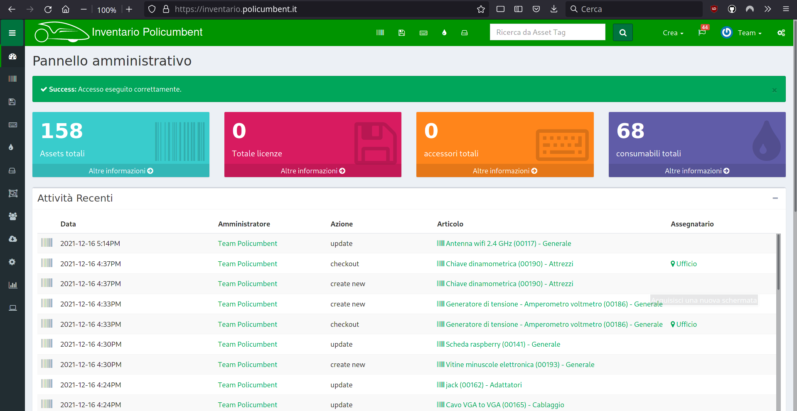
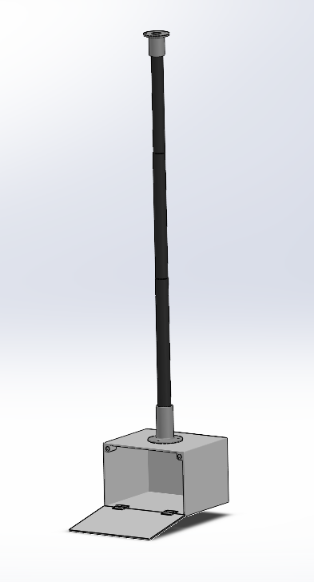

# Inventario

Abbiamo un software per tenere traccia di tutti gli oggetti di proprietà del team (e gli UTO)

<!-- block-start: img -->

<!-- block-end -->

USIAMOLO!

---

## Grazie reparto Gestione <i class="fas fa-heart"></i>

<!-- block-start: img -->

<!-- block-end -->

<!-- block-start: icon -->

<!-- block-end -->

---

# Stazione Meteo: serial release

Ci saranno ~~più~~ TRE stazioni che comunicano i dati in tempo reale:

<!-- block-start: little-space -->
<!-- block-end -->

- Nuovo case
- Schede custom
- ~~Sim IoT~~ Comunicazione peer con LoRA a 433MHz

---

## Case

- Scatola pcb <i class="fas fa-check"></i>
- Supporto asta <i class="fas fa-check"></i>
- Supporto anemomentro e banderuola <i class="fas fa-ellipsis-h"></i>
- Supporto batterie <i class="fas fa-ellipsis-h"></i>
- Supporto antenne LoRA <i class="fas fa-times"></i>
- Inserti treppiedi <i class="fas fa-times"></i>

<!-- block-start: little-space -->
<!-- block-end -->

### Siamo a buon punto!

---

---

## PCB Stazione Meteo

### (Quasi) Pronto:

<!-- block-start: little-space -->
<!-- block-end -->

- Aggiunta diodi di protezione
- Definire posizione sensori
- Mandare in stampa

---

## ~~Software Stazione Meteo~~

# SARA

Stazione Analisi Raffiche Avverse

<!-- block-start: img -->

<!-- block-end -->

---

# Analisi dati

- [Refactoring](https://github.com/policumbent/analisi-dati/pull/1) simulazione matlab <i class="fas fa-check"></i>
- Migrazione codice in python <i class="fas fa-ellipsis-h"></i>
- Hosting simulazione su un server privato <i class="fas fa-times"></i>

<!-- block-start: img -->

<!-- block-end -->

Adesso non è più magia nera!

---

# Trasmissione Cerberus

Più lavoro per gli elettroinformatici!

<!-- block-start: little-space -->
<!-- block-end -->

<!-- block-start: little-space -->
<!-- block-end -->

- Controllore PID con ESP32
- Calibrazione con MQTT e Bluetooth
- Macchina a stati con `idle=cambio_marcia`
- Sequenze tasti manubrio per cambiare stato

---

# Manutenzione

Ago <i class="fas fa-check"></i>

Sofia <i class="fas fa-check"></i>

BOB <i class="fas fa-ellipsis-h"></i>

Pino <i class="fas fa-ellipsis-h"></i>

ALICE <i class="fas fa-times"></i>

martina <i class="fas fa-times"></i>

ElisaBot <i class="fas fa-times"></i>

<!-- block-start: img -->

<!-- block-end -->
