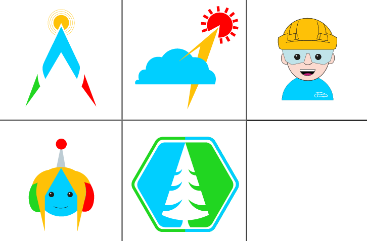

# Loghi

<!-- block-start: img -->

<!-- block-end -->

---

# Sponsor

Presentare in modo ordinato i nostri progetti è un plus di credibilità

---

# Sponsor!

Al momento l'unico sponsor è [DatoCMS](https://www.datocms.com/) <i class="fas fa-heart"></i>

per il sito jamstack del team

<!-- block-start: space -->
<!-- block-end -->

Mai avuti sponsor di elettronica!

---

# SPONSOR!!

Ci servono:

<!-- block-start: little-space -->
<!-- block-end -->

- che stampino PCB
- che abbiano componenti (servo, esp, raspberry ...)
- che abbiano strumenti da lavoro (cavi, saldatori, connettori ...)

<!-- block-start: little-space -->
<!-- block-end -->

## Ma soprattutto:

# <i class="fas fa-hand-holding-heart"></i>
